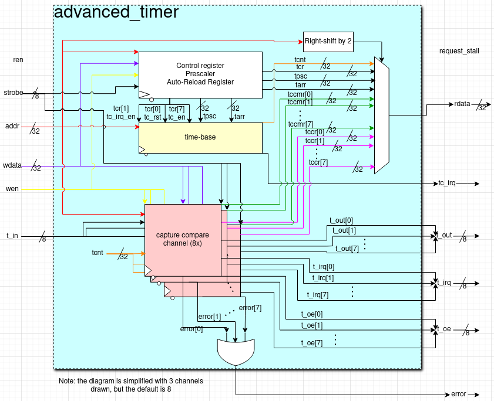

# Timer

## Timer Description
Advanced timer with time-base and 8 capture-compare channels
## Block Diagram

## Main Features
- A hardware timer on a high-level is an internal peripheral that can periodically generate interrupts (https://python.quectel.com/doc/Application_guide/en/system/Timer.html)
- For example, hardware timers can be configured to generate interrupts, let's say every second or at 1 Hz frequency. An interrupt service routine (ISR) can then be written for that interrupt, such as an LED blinking function that blinks an LED at 1 Hz.
- Beyond basic internal functions of generating periodic interrupts, advanced timers also have input capture, output compare, and PWM generation capabilities that can be used with external input/output applications
- This advanced timer has 8 independent capture-compare channels, meaning one possible configuration of the channels could have 
  - 3 channels be configured as input capture
    - using 3 of the 8 external input t_in pins
    - First channel captures rising edges, second captures falling edges, and third captures both
  - 5 channels configured as output compare / PWM generation
    - using 5 of the 8 external output t_out pins
    - 3 channels are output compare - first channel goes high when the counter matches its (the first channel's) tccr register value, second channel goes low when the counter matches its (the second channel's) tccr value, and third channel toggles its output pin when the counter reaches its tccr value
    - 2 channels are used for PWM generation - first channel output is set high when counter is less than its tccr register value, and second channel output is set high when counter is greater than or equal to its tccr register value
- Of course, some capture-compare channels may sit idle and left disabled if not all 8 channels need to be used

## Working with the timer
 - The timer is software configurable, meaning you can read/write from/to the various registers in the timer as if they were memory-mapped. Please see the register map for more details
    - It was also modeled after the timer in the STM32F0 Family Reference Manual, so experience in programming microcontrollers, particularly having taken ECE 362 will help in understanding how to work with the timer
 - In particular, the time-base and the counter interrupt need to be enabled by writing to the timer control register (tcr)
 - To configure each channel, the timer capture-compare mode register (tccmr) will need to have the corresponding bits set to enable the channel, set the input/output mode, etc.
