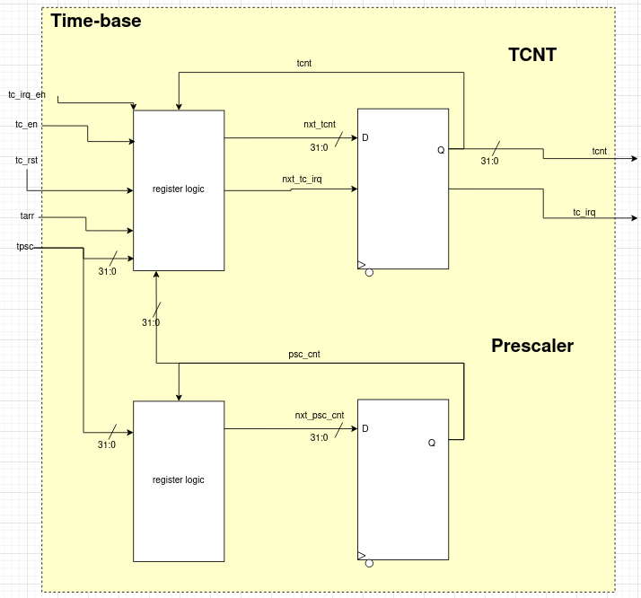

# Time-base

## Time-base Description
32-bit up counter controlled by Timer Control Register (TCR), Timer Prescaler (TPSC), and Timer Auto-Reload Register (TARR)
## Block Diagram

## Main Features
- Timer Control Register
  - By default, timer is disabled and timer interrupt is disabled - write to each bit to enable
  - Comes with a synchronous reset to 0. If used, disable the timer, activate the reset, re-enable the timer, and deactivate the reset

- Timer Prescaler
  - This register scales down the clock frequency of the counter
  - By default, the prescaler is set to 0 meaning the system clock is passed-through to the timer without any scaling
  - The frequency of the counter is the value of the system clock being fed into the timer divided by the value of the prescaler register plus 1, or f_clk_cnt = f_clk_psc / (tpsc + 1)
  - e.g. if system clock is 72 MHz and we want counter operating at 36 MHz, we set tpsc = 1 such that f_clk_cnt = 72 MHz / (1 + 1) = 36 MHz

- Timer Auto-Reload Register
  - This is the maximum value the counter will count up to before overflowing back to 0
  - By default, it is set to 0xFFFF_FFFF, or the maximum value a 32-bit register can hold
  - if interrupt enabled, tc_irq will go high on rollover
