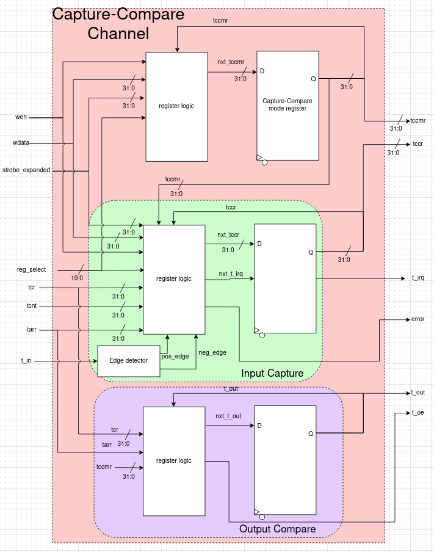

# Capture-Compare Channel

## Capture-Compare Channel Description
A channel used in advanced timer for input-capture, output-compare, or PWM generation

## Block Diagram

## Main Features
- Timer Capture-Compare Mode Register
  - Software write to this register to enable and set the mode for the channel
  - This is probably the most confusing register to use, as different bits will be applicable depending on whether or not it's being set to input or output mode
  - Regardless of input-capture or output-compare mode, set the enable bit high to use the channel
  - Set the direction of the channel - will it be input (TI1_IN == 0x1) or output (0x0)?
  - Enable interrupts if necessary - activates on input transition when in input-capure mode and when counter matches tccr register value when in output-compare mode
  - If in input-capture mode, set the polarity i.e. should it capture the count on a rising edge, falling edge, or both?
  - If in output-compare mode, set the output mode
    - FROZEN - the output doesn't do anything meaningful and just holds its last value
    - FORCE LOW - output is forced low, regardless of tcnt
    - FORCE HIGH - output is forced high, regardless of tcnt
    - MATCH LOW - if tcnt == tccr, output is set low
    - MATCH HIGH - if tcnt == tccr, output is set high
    - TOGGLE - if tcnt == tccr, output is toggled i.e. from low to high or high to low
    - PWM1 - if tcnt < tccr, output is high, and if tcnt >= tccr, output is low
    - PWM2 - if tcnt < tccr, output is low, and if tcnt >= tccr, output is high

- Timer Capture-Compare Register
  - When in input-capture mode, if the input signal is detected to have an edge transition of the polarity set in the tccmr, then the current count (tcnt) is latched into this register
  - When in output-compare mode, the desired value to be compared to tcnt should be written into this register
